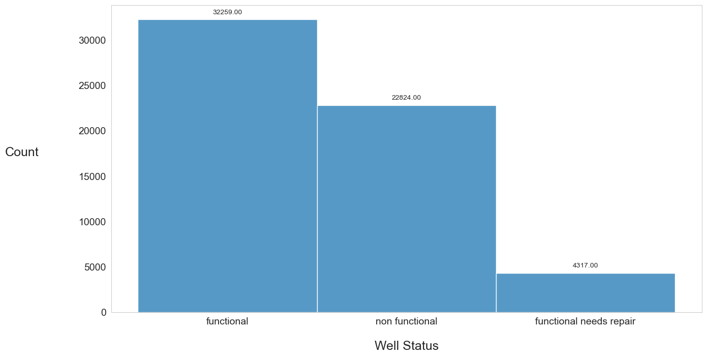
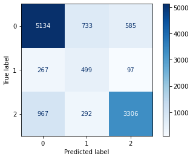
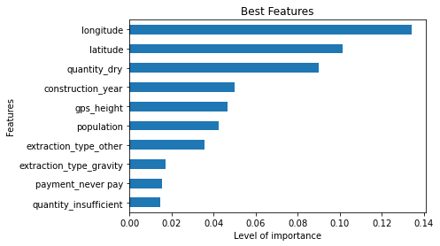
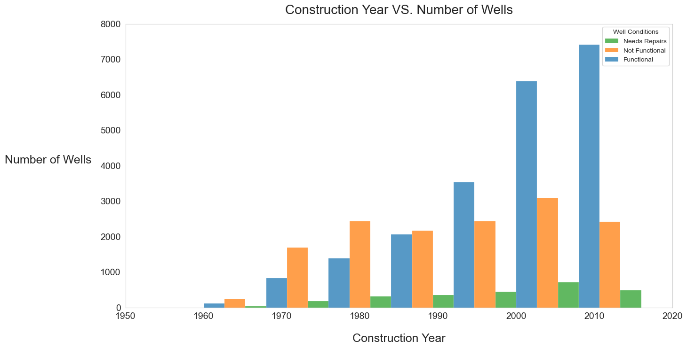
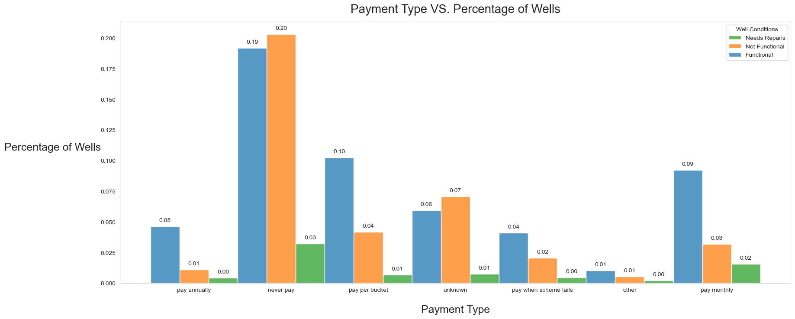
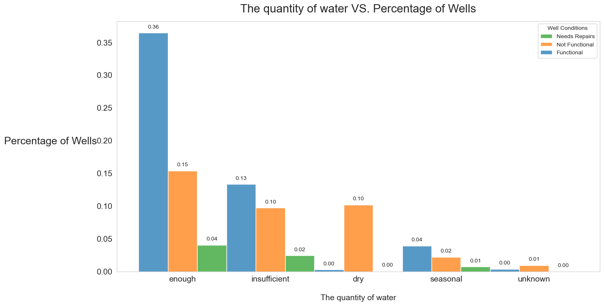

# project_tanzania

## Business problem

It is imperative for the Government of Tanzania to provide its people with clean water. Our goal is to help the Tanzanian Ministry of Water strategically predict which water pumps are functioning, which need repairs, and which don’t work at all. 


## DATA
The data comes from the Taarifa waterpoints dashboard which aggregates data for the Tanzanian Ministry of Water. Taarifa is an open source platform for the crowdsourced reporting and triaging of infrastructure related issues. The dataset contains 59,400 data points with 39 features. 

## Methods 

The first step was cleaning and  preparing our data. The dataset contained many repetitive and similar columns. For example, the ‘waterpoint_type’ and ‘waterpoint_type_group’ tracked the same data, but one column was raw and granular whereas the other column seemed to be categorizing these raw data. We decided to keep the columns that were more granular because we expected to clean and preprocess the dataset, which seemed to be having many missing and ambiguous data. 

There were also many redundant columns, describing geographic location, including latitude, longitude, region, sub village, and lga. We decided to keep longitude, latitude, and lga only for regional data. Any extra regional features were likely to have multicollinearity with the rest because they all described geographic location but in different terms.  

Next, we investigated null values in the dataset. There were null values in some features we wanted to keep such as the ‘funder’ column. These null values were about 10% of our data. We thought our dataset was large enough and thus we dropped all the null values. We still were left with more than 40,000 data points.

We also found that there were many zero values in several features such as ‘construction_year’ and ‘population’, which seemed odd.  We decided to clean ‘construction_year’, ‘gps_height (altitude of the well)’, ‘amount_tsh (water available to waterpoint)’ and ‘population’. We did not want to simply drop these zero values because they were a large part of the dataset. Instead,  we decided to create a new missing indicator column for them.


 
In addition, there was class imbalance among three classes (wells functional, not functional, needs repairs). To mitigate the imbalance issue, we added a parameter, stratify, when splitting our dataset into train and test sets and decided to use SMOTE. 

Then, we utilized the column transformer and the pipelines to apply SMOTE to the data set, to turn all categorical features into dummy variables, and to scale all numerical features. 

From here, we tried building various models. 

## Results 

We started with a baseline model using the Dummy Classifier. This model had an accuracy score of 0.54.

For our first models, we created a few vanilla models: 

Vanilla Models
Accuracy Scores (test  set)
Accuracy Scores (train set)
Decision Tree
0.75
0.99
Random Forest
0.80
0.99
XG Boosting
0.75
0.78
Gradient Boosting
0.69
0.


Our vanilla models performed significantly better than the baseline model. However, as seen above table, the Decision Tree model and the Random Forest model were overfitting. 

We then used Grid Search to try to reduce overfitting and find the best parameters for the models. 




After trying grid search with each vanilla model, we see that the best performing model is XXXX model with our set parameters. This model has an accuracy score of 0.---. Also, this model has a much higher true positive rate for the pumps that are either not functioning or need repairs. It can correctly identify the pumps that need repairs 78% of the time and the pumps not functioning 77% of the time. This is especially helpful when trying to improve maintenance operations and water accessibility for the communities across Tanzania. 


## Recommendations

Our final model predicts the functionality of wells based on a couple of key features. Some of the best predictors in helping to determine functionality are construction year, payment type and water quantity. 



As we can see, the construction year had a correlation with the condition of a well. The older construction years particularly before 1990 had a higher ratio of non-functioning to functioning wells, while the newer ones had the opposite ratio. We recommend the government focus on this factor when trying to target non functioning wells. 



Another feature that affected the functionality of a well was the payment type. The non-functioning wells were largely in areas where citizens did not pay fees for the well. It is suggested that maybe the government subsidizes areas where there is no proper local government infrastructure to collect fees and perform upkeep.

The payment fees for a well were also a factor in predicting whether pumps would remain functional or not. Pumps with payment options annually, monthly, or per bucket were more likely to be functioning. The pumps with no payment fees were the large majority of non-functioning pumps.


The third feature was the quantity of water available. In areas with enough water available the water pumps were most likely to be functional. 


### Repository Structure 

```bash

├── README.md
├── .gitignore
├── data      <-- CSV files used in analyses
├── Images      <-- Externally obtained and internally generated images
│ 
│ 
├── tanzania3_overview.ipynb  
├── tanzania3_gridsearch.ipynb  <--- Jupyter Notebook for gridsearching  
├── tanzania3_main.ipynb   <-- Jupyter Notebook illustrating analysis 
│ 
└── tanzania3.pdf   <-- Presentation slides

```
